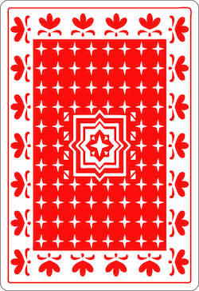

# jQuery 101

---
Welcome back! In this lesson you will begin to use JS to work with
your web pages. Although there are many different ways to do this
with JS, we will use the [jQuery library](https://jquery.com/).
**********************************************************
## The World Before jQuery

* JS code is cumbersome
* IE vs Firefox
* JS behavior was inconsistent between browsers

---
First, a brief look at the history of jQuery. Before
there was jQuery, writing JS for web pages was hard.

Writing JS code to interact with the DOM was fairly verbose
and cumbersome, especially when working with multiple elements.

It was made harder because we had 2 major browser vendors:
Internet Explorer (IE), and Firefox. Although both of them
ran JS, the JS behavior between them was different, especially
when it came to interacting with the DOM. This cause a lot of
headaches for web developers, and they often had to resort
to coming up with techniques for detecting which browser their
code was running in, and then using an if statement to select
a different course of action for IE vs Firefox.
**********************************************************
## jQuery

* Created in 2006 by John Resig
* Concise Code
* Works for all browsers

---
John Resig created jQuery in 2006 to solve these two problems
web developers faced. Writing code in jQuery to interact with
the web page is very concise, and it is almost guaranteed to work
for all browsers.

Interest in JS grew after the birth of jQuery and it made the web
platform much more attractive for the developer community as a whole.

***Hooray!!!***

Now, let's get technical...
**********************************************************
## The DOM

HTML file:
```html
<!DOCTYPE html>
<html>
  <head>
    <meta charset="utf-8">
    <title>My Home Page</title>
  </head>
  <body>
    <h1 id="header">My Home Page</h1>
    <p id="paragraph">Welcome to my humble abode.</p>
  </body>
</html>
```

---
First I need to tell you what the DOM is --- it stands for
*Document Object Model*.

What you see right now is an HTML file. It is a tree
consisting of a series of nested tags.

The DOM has this exact same structure when this page
is loaded in the browser.

To see this, please type this code into a `index.html`,
and then open it in Chrome.
**********************************************************
## The DOM


---
You should see something like this.
**********************************************************
## DOM Inspection


---
Now, we'll open the DOM inspector (a.k.a Elements Panel) by right-clicking on the paragraph
text, and selecting "Inspect".
**********************************************************
## DOM Inspection


---
This is what you should see.
**********************************************************
## DOM Inspection


---
And this is the DOM!!!

The DOM mirrors the structure of the HTML code, but it allows
you to collapse or expand any node in the tree by clicking
on the little rotating triangle to the left of it.

The currently highlighted node is the one you right-clicked on
on the page --- the paragraph.
**********************************************************
## DOM Inspection


---
Another thing about the DOM that is different from your HTML
file is that it is *live*!!!
That means you are seeing the most current version of this tree
structure, and if the structure happens to change, you will see
it change right away.
**********************************************************
## Tags vs Elements


---
There is a terminology difference between HTML speak vs DOM
speak. In HTML, you might have referred to each of the
angle bracket things --- such as `<p>stuff</p>` as a tag.
In DOM speak, we don't call them tags. We call them elements.

So, instead of: "the p tag" or the "h1 tag", we'll call them
"the p element", and "the h1 element".

We will use jQuery to make changes to the DOM, and
when we do, we can see the changes happen live in the DOM
inspector --- a.k.a. the Elements panel. This is a good
tool for debugging your code if it doesn't work right.
**********************************************************
## Adding jQuery to Your Page


---
So let's add jQuery to our code! Go to <http://jquery.com>,
and then click on that big ol' orange button that says "Download
jQuery".
**********************************************************
## Adding jQuery to Your Page


---
When you get to this page
**********************************************************
## Adding jQuery to Your Page


---
Right-click the link that reads:
"Download the uncompressed version, development jQuery X.Y.Z",
and then select "Save Link As...".
**********************************************************
## Adding jQuery to Your Page


---
When the save file dialog comes up, rename the file to `jquery.js`
(you are removing the version number), and save it in the
same directory as your `index.html`.
**********************************************************
## Adding jQuery to Your Page

```html
<!DOCTYPE html>
<html>
  <head>
    <meta charset="utf-8">
    <title>My Home Page</title>
  </head>
  <body>
    <h1 id="header">My Home Page</h1>
    <p id="paragraph">Welcome to my humble abode.</p>
  </body>
  [[[<script src="jquery.js"></script>]]]
</html>
```

---
Now, we want to add a script tag to the HTML file to tell
the browser to load jQuery whenever the page is loaded.
**********************************************************
## Adding jQuery to Your Page

```html
<!DOCTYPE html>
<html>
  <head>
    <meta charset="utf-8">
    <title>My Home Page</title>
  </head>
  <body>
    <h1 id="header">My Home Page</h1>
    <p id="paragraph">Welcome to my humble abode.</p>
  </body>
  <script src="jquery.js"></script>
  [[[<script>
  </script>]]]
</html>
```

---
And to test that jQuery works, let's add a line of JS
that turns the header red.

To do that, We need another script tag --- make sure you
put it after the jQuery script tag, and that this one has
no `src` attribute.
**********************************************************
## Adding jQuery to Your Page

```html
<!DOCTYPE html>
<html>
  <head>
    <meta charset="utf-8">
    <title>My Home Page</title>
  </head>
  <body>
    <h1 id="header">My Home Page</h1>
    <p id="paragraph">Welcome to my humble abode.</p>
  </body>
  <script src="jquery.js"></script>
  <script>
  [[[$("#header").css("background-color", "red");]]]
  </script>
</html>
```

---
Then within that script tag, put in this line JS. It will
turn the header's background color to red.

Now, after making this change to the file, please go back to your
Chrome browser, and reload this page.
**********************************************************
## Adding jQuery to Your Page


---
If it worked, you should see something like this!

Notice that in the h1 element, there is a `style` attribute
whose value is "background-color: red". That's what we did
with that line of JS.
**********************************************************
## jQuery Didn't Work?


---
If it didn't work, check the "Console" panel (right next the to
"Elements" tab). If you see an error like this:

*Uncaught ReferenceError: $ is not defined*

that means the jQuery script didn't work. It could be one of
the following reasons...
**********************************************************
## jQuery Didn't Work?

1. `jquery.js` doesn't exist
2. Script tag has an error
3. Order of the script tags is reversed

---
The `jquery.js` file is either not in the same folder as
the HTML file, or it is misnamed.

Or the script tag to include the `jquery.js` file has a
mispelling or syntax error in it.

Or the two script tags --- one for `jquery.js` and the other
to make the header background color red --- are in reverse
order. The jQuery one should come first.

Check all of these things to see that they are in order.
If you are stuck, ask your mentor for help.
**********************************************************
## Learn You Some jQuery

```html
<!DOCTYPE html>
<html>
  <head>
    <meta charset="utf-8">
    <title>Example</title>
  </head>
  <body>

    HTML_BODY_CONTENT

  </body>
  <script src="jquery.js"></script>
  <script>

  JS_CODE

  </script>
</html>
```

---
Now that you have things set up, we'll use this HTML template
for each example we are going to do going forward.

Where it says `HTML_BODY_CONTENT`, we will put in the
initial content within the body of the page.

Where is says `JS_CODE` we will put in JS code that uses
jQuery.

Are you ready? Okay, let's go...
**********************************************************
## Changing Background Color

HTML_BODY_CONTENT
```html
<h1 id="header">My Home Page</h1>
<p id="paragraph">Welcome to my humble abode.</p>
```

JS_CODE
```js
$("#header").css("background-color", "red");
```

---
This is the state we left our `index.html` page in.

Let's talk about what this JS is actually doing.
**********************************************************
## Changing Background Color

HTML_BODY_CONTENT
```html
<h1 id="header">My Home Page</h1>
<p id="paragraph">Welcome to my humble abode.</p>
```

JS_CODE
```js
[[$]][[The mighty $]]("#header").css("background-color", "red");
```

---
First let's talk about the dollar sign. To a lot of people
new to jQuery, actually, even some that have used jQuery,
this `$` seems like magic, but it isn't magic at all.

`$` is a valid variable name in JS, and jQuery chose to
use it because it looks different and --- because it's only
one character --- makes your code very concise.

But `$` is nothing more than a function.
**********************************************************
## Changing Background Color

HTML_BODY_CONTENT
```html
<h1 id="header">My Home Page</h1>
<p id="paragraph">Welcome to my humble abode.</p>
```

JS_CODE
```js
[[$("#header")]][[Calling $ with "#header"]].css("background-color", "red");
```

---
We are calling the `$` function here with the argument `"#header"`.
**********************************************************
## Changing Background Color

HTML_BODY_CONTENT
```html
<h1 id="header">My Home Page</h1>
<p id="paragraph">Welcome to my humble abode.</p>
```

JS_CODE
```js
$([["#header"]][[ID Selector]]).css("background-color", "red");
```

---
`#header` is a CSS selector --- in particular --- an *ID Selector*.
It is used to find the element in the page that has the `id` attribute
of "header".
**********************************************************
## Changing Background Color

HTML_BODY_CONTENT
```html
[[<h1 id="header">My Home Page</h1>]][[found element with id=header]]
<p id="paragraph">Welcome to my humble abode.</p>
```

JS_CODE
```js
$("#header").css("background-color", "red");
```

---
When jQuery sees this, it goes into the DOM to find an
element whose `id` is "header" --- that's our h1 element
--- and then...

**********************************************************
## Changing Background Color

HTML_BODY_CONTENT
```html
<h1 id="header">My Home Page</h1>
<p id="paragraph">Welcome to my humble abode.</p>
```

JS_CODE
```js
[[$("#header")]][[This is the header now]].css("background-color", "red");
```

---

returns it back to the caller of the function.
**********************************************************
## Changing Background Color

HTML_BODY_CONTENT
```html
<h1 id="header">My Home Page</h1>
<p id="paragraph">Welcome to my humble abode.</p>
```

JS_CODE
```js
$("#header")[[.css("background-color", "red")]][[Set the background-color CSS property to red]];
```

---
After the header has been found, in the next step we call
the `css` method on the header element
to change its background color to red.
**********************************************************
## Challenge

HTML_BODY_CONTENT
```html
<h1 id="header">My Home Page</h1>
<p id="paragraph">Welcome to my humble abode.</p>
```

JS_CODE
```js
$("#header").css("background-color", "red");
```

---
Now, time for a challenge! Change this code to set the
paragraph's text color to blue.

Create a new HTML file based on the template first, before
you attempt this challenge. You may name the file what you
want to name it. Turn to the next slide for the solution...
**********************************************************
## Solution

HTML_BODY_CONTENT
```html
<h1 id="header">My Home Page</h1>
<p id="paragraph">Welcome to my humble abode.</p>
```

JS_CODE
```js
$("#paragraph").css("color", "blue");
```

---
Here is the solution. To change the paragraph's text
to blue, we needed to change the CSS selector, the
CSS property to `color` and the color value to blue.
**********************************************************
## Changing Text

HTML_BODY_CONTENT
```html
<h1 id="header">My Home Page</h1>
<p id="paragraph">Welcome to my humble abode.</p>
```

JS_CODE
```js
$("#paragraph").text("You are in my territory now.");
```

---
In addition to changing the styling of an element,
another thing you could do is change its text.
**********************************************************
## Changing Text

HTML_BODY_CONTENT
```html
<h1 id="header">My Home Page</h1>
<p id="paragraph">Welcome to my humble abode.</p>
```

JS_CODE
```js
[[$("#paragraph")]][[get the paragraph]].text("You are in my territory now.");
```

---
When changing text, you first need to get an element
to change, using a CSS selector, in the same way as before,
**********************************************************
## Changing Text

HTML_BODY_CONTENT
```html
<h1 id="header">My Home Page</h1>
<p id="paragraph">Welcome to my humble abode.</p>
```

JS_CODE
```js
$("#paragraph")[[.text("You are in my territory now.")]][[Change paragraph text to "You are in my territory now."]];
```

---
then you call the `text` method on that element, passing
the new text you want the element to contain as the
argument.
**********************************************************
## Changing Text

HTML_BODY_CONTENT
```html
<h1 id="header">My Home Page</h1>
<p id="paragraph">Welcome to my humble abode.</p>
```

JS_CODE
```js
var existingText = $("#header").text();
console.log(existingText);
```

---
If, on the other hand, you want to get the text off of
an element, you call the same `text` method, only
this time without giving it any arguments.

This JS code will print the existing text of the header:
"My Home Page" to the JS console.

You'll need to switch to the Console Panel to see the
print out.
********************************************************
### Changing Text

HTML_BODY_CONTENT
```html
<h1 id="header">My Home Page</h1>
<p id="paragraph">Welcome to my humble abode.</p>
```

JS_CODE
```js
function reverse(text) {
  var reversed = "";
  var chars = text.split("");
  chars.forEach(function(char) {
    reversed = char + reversed;
  });
  return reversed;
}
var existingText = $("#header").text();
$("#header").text(reverse(existingText));
```

---
If you want to change the text based on its existing text:
first call `text()` without an argument to get the
existing text, then change the text, then call `text(newText)`
with the new text as the argument.

This code reverses the letters of the header.
********************************************************
### Changing Text

HTML_BODY_CONTENT
```html
<h1 id="header">My Home Page</h1>
<p id="paragraph">Welcome to my humble abode.</p>
```

JS_CODE
```js
[[[function reverse(text) {
  var reversed = "";
  var chars = text.split("");
  chars.forEach(function(char) {
    reversed = char + reversed;
  });
  return reversed;
}]]]
var existingText = $("#header").text();
$("#header").text(reverse(existingText));
```

---
This function --- I hope you can verify --- reverses
a string.

********************************************************
### Changing Text

HTML_BODY_CONTENT
```html
<h1 id="header">My Home Page</h1>
<p id="paragraph">Welcome to my humble abode.</p>
```

JS_CODE
```js
function reverse(text) {
  var reversed = "";
  var chars = text.split("");
  chars.forEach(function(char) {
    reversed = char + reversed;
  });
  return reversed;
}
[[var existingText = $("#header").text();]][[Get the text from header]]
$("#header").text(reverse(existingText));
```

---
This line gets the existing text from the header and stores
it in the `existingText` variable, which will be "My Home Page".
********************************************************
### Changing Text

HTML_BODY_CONTENT
```html
<h1 id="header">My Home Page</h1>
<p id="paragraph">Welcome to my humble abode.</p>
```

JS_CODE
```js
function reverse(text) {
  var reversed = "";
  var chars = text.split("");
  chars.forEach(function(char) {
    reversed = char + reversed;
  });
  return reversed;
}
var existingText = $("#header").text();
$("#header").text([[reverse(existingText)]][[reverses the string]]);
```

---
Then this call to the `reverse` function reverses that text,
and we take the return value of the function directly and
********************************************************
### Changing Text

HTML_BODY_CONTENT
```html
<h1 id="header">My Home Page</h1>
<p id="paragraph">Welcome to my humble abode.</p>
```

JS_CODE
```js
function reverse(text) {
  var reversed = "";
  var chars = text.split("");
  chars.forEach(function(char) {
    reversed = char + reversed;
  });
  return reversed;
}
var existingText = $("#header").text();
[[$("#header").text(reverse(existingText))]][[Changes header text to reversed version]];
```

---
pass it as the argument of the text method in order to change
the header text.
********************************************************
## Events and the `on` Method

```js
$("#header").on("click", function() {
  console.log("You clicked on the header!!");
});
```

---
So change things on the page is pretty cool. But
it's not interactive until you make changes to the page
based on an interaction --- such as a mouse click.

The `on` method does just that!

These 3 lines of code is actually one statement. It
registers a click event handler for the header element.

Let's walk through this code...
********************************************************
### Events and the `on` Method

```js
[[$("#header")]][[Get the header from the DOM]].on("click", function() {
  console.log("You clicked on the header!!");
});
```

---
Again, we use the `$` function to get the header
element from the DOM, based on its ID.
********************************************************
### Events and the `on` Method

```js
$("#header")[[.on("click", function() {
  console.log("You clicked on the header!!");
})]][[Register the click event]];
```

---
then we call the `on` method, which takes two arguments.

The word *on* can be interpreted as "on the event that..."
********************************************************
### Events and the `on` Method

```js
$("#header").on([["click"]][[The click event]], function() {
  console.log("You clicked on the header!!");
});
```

---
The first argument is the name of the event --- in this
case `click`. The names of the events are well known
and are based on web standards. In addition to `click`,
other names of events are `keyup`, `keydown`, `mousemove`,
and `dbclick`.

A `click` event occurs each time the mouse is clicked.
In this case, because we are registering the event handler
on the header element specifically, `click` events will
only occur if the header element is clicked.
********************************************************
### Events and the `on` Method

```js
$("#header").on("click", [[function() {
  console.log("You clicked on the header!!");
}]][[Click handler]]);
```

---
The second argument we pass to the `on` method is
an event handler. We write it as an inlined function
--- the same way we passed an inlined function to the `forEach`
method.

The `on` method will register this event handler with
any click event that came from the header, which means
it will call this function each time a click event occurs.
********************************************************
### Events and the `on` Method


---
Load up this page, open the Console panel so that you can
see the console.log statements come out, then click on the
header text 3 times.

You should see this. Chrome groups the same print outs
together and puts a little number bubble to the left
of that print out. Each time you click, the number on the
left will go up by 1.

Try this out for yourself.
********************************************************
## Challenge

HTML_BODY_CONTENT
```html
<h1 id="header">My Home Page</h1>
<p id="paragraph">Welcome to my humble abode.</p>
```

JS_CODE
```js
$("#header").on("click", function() {
  console.log("You clicked on the header!!");
});
```

---
Now, my challenge to you is to change this program
so that when the header is clicked, its text reverses.
If you click it again, it reverses again, and again...
You may use the `reverse` function in the previous
example.

When you are ready, turn to the next slide to see the solution.
********************************************************
### Solution

HTML_BODY_CONTENT
```html
<h1 id="header">My Home Page</h1>
<p id="paragraph">Welcome to my humble abode.</p>
```

JS_CODE
```js
function reverse(text) {
  var reversed = "";
  var chars = text.split("");
  chars.forEach(function(char) {
    reversed = char + reversed;
  });
  return reversed;
}
$("#header").on("click", function() {
  var existingText = $("#header").text();
  $("#header").text(reverse(existingText));
});
```

---
We are using the same `reverse` function as before.
********************************************************
### Solution

HTML_BODY_CONTENT
```html
<h1 id="header">My Home Page</h1>
<p id="paragraph">Welcome to my humble abode.</p>
```

JS_CODE
```js
function reverse(text) {
  var reversed = "";
  var chars = text.split("");
  chars.forEach(function(char) {
    reversed = char + reversed;
  });
  return reversed;
}
$("#header").on("click", function() {
[[  var existingText = $("#header").text();
  $("#header").text(reverse(existingText));]][[Reverses the header text]]
});
```

---
These two lines reverse the header text --- they are
identical to the previous reverse-the-header-text example.
********************************************************
### Solution

HTML_BODY_CONTENT
```html
<h1 id="header">My Home Page</h1>
<p id="paragraph">Welcome to my humble abode.</p>
```

JS_CODE
```js
function reverse(text) {
  var reversed = "";
  var chars = text.split("");
  chars.forEach(function(char) {
    reversed = char + reversed;
  });
  return reversed;
}
$("#header").on("click", [[function() {
  var existingText = $("#header").text();
  $("#header").text(reverse(existingText));
}]][[event handler]]);
```

---
But this time, they are inside a click handler, which make
them activate everything the header is clicked.
********************************************************
### Example: Multiple Buttons

HTML_BODY_CONTENT
```html
<h1 id="header">My Home Page</h1>
<button id="uppercase">Uppercase</button>
<button id="multiply">Multiply</button>
```

JS_CODE
```js
$("#uppercase").on("click", function() {
  var existingText = $("#header").text();
  $("#header").text(existingText.toUpperCase());
});

$("#multiply").on("click", function() {
  var existingText = $("#header").text();
  $("#header").text(existingText + existingText);
});
```

---
Let's switch gears. This is an example where there
are multiple buttons.

The "Uppercase" button changes the header text to all
uppercase, while the "Multiply" button will
make a copy of the header text and append it to itself.
********************************************************
### Example: Multiple Buttons

HTML_BODY_CONTENT
```html
<h1 id="header">My Home Page</h1>
<button id="uppercase">Uppercase</button>
<button id="multiply">Multiply</button>
```

JS_CODE
```js
[[$("#uppercase").on("click", function() {
  var existingText = $("#header").text();
  $("#header").text(existingText.toUpperCase());
});]][[registers click handler for uppercase button]]

$("#multiply").on("click", function() {
  var existingText = $("#header").text();
  $("#header").text(existingText + existingText);
});
```

---
This statement registers the click handler for the
"Uppercase" button. It says: on the event that
someone clicked on the Uppercase button,
********************************************************
### Example: Multiple Buttons

HTML_BODY_CONTENT
```html
<h1 id="header">My Home Page</h1>
<button id="uppercase">Uppercase</button>
<button id="multiply">Multiply</button>
```

JS_CODE
```js
$("#uppercase").on("click", [[function() {
  var existingText = $("#header").text();
  $("#header").text(existingText.toUpperCase());
}]][[event handler function]]);

$("#multiply").on("click", function() {
  var existingText = $("#header").text();
  $("#header").text(existingText + existingText);
});
```

---
I want this function to be executed.
********************************************************
### Example: Multiple Buttons

HTML_BODY_CONTENT
```html
<h1 id="header">My Home Page</h1>
<button id="uppercase">Uppercase</button>
<button id="multiply">Multiply</button>
```

JS_CODE
```js
$("#uppercase").on("click", function() {
  var existingText = $("#header").text();
  $("#header").text(existingText.toUpperCase());
});

[[$("#multiply").on("click", function() {
  var existingText = $("#header").text();
  $("#header").text(existingText + existingText);
});]][[registers event handler for multiple button]]
```
---
This statement does the same thing for the Multiply
button, only with a different event handler function
that doubles the text instead of uppercases it.
********************************************************
### Challenge

HTML_BODY_CONTENT
```html
<h1 id="header">My Home Page</h1>
<button id="uppercase">Uppercase</button>
<button id="multiply">Multiply</button>
```

JS_CODE
```js
$("#uppercase").on("click", function() {
  var existingText = $("#header").text();
  $("#header").text(existingText.toUpperCase());
});

$("#multiply").on("click", function() {
  var existingText = $("#header").text();
  $("#header").text(existingText + existingText);
});
```
---
Try running this example in Chrome. Then, try
adding a new button that makes the text lowercase.
********************************************************
## Setting an Attribute

HTML_BODY_CONTENT
```html

```


*<https://commons.wikimedia.org/wiki/File:Card_back_01.svg>*

---
Another thing you can do with jQuery is to change the
attribute of an element.

Here we have an image element. It has 3 attributes:

* `id`  whose value is `card`
* `src` whose value is `images/card_back.png`
* `alt` whose value is `A Poker Card`
********************************************************
### Setting an Attribute

HTML_BODY_CONTENT
```html

```

JS_CODE
```js
$("#card").attr("src", "images/ace_of_spades.png");
```


---

If we wanted to change the image to reveal a card,
all we have to do is to change its `src` attribute
to a path of the image of the revealed card ---
in this case, `images/ace_of_spades.png`.
********************************************************
### Setting an Attribute

HTML_BODY_CONTENT
```html

```

JS_CODE
```js
[[$("#card")]][[get the img element by ID]].attr("src", "images/ace_of_spades.png");
```


---
This code first gets the `` element based on its ID.
********************************************************
### Setting an Attribute

HTML_BODY_CONTENT
```html

```

JS_CODE
```js
$("#card")[[.attr("src", "images/ace_of_spades.png")]][[sets the src attribute]];
```


---
Then, it calls the `attr` method, which sets the src attribute
to a new value. It takes two arguments.
********************************************************
### Setting an Attribute

HTML_BODY_CONTENT
```html

```

JS_CODE
```js
$("#card").attr([["src"]][[The name of the attribute]], "images/ace_of_spades.png");
```


---
The first argument is the name of the attribute we are changing. In this case
it's `src`.
********************************************************
### Setting an Attribute

HTML_BODY_CONTENT
```html

```

JS_CODE
```js
$("#card").attr("src", [["images/ace_of_spades.png"]][[New attribute value]]);
```


---
The second argument is the new attribute value that will be assigned.
********************************************************
### Challenge

HTML_BODY_CONTENT
```html

```

JS_CODE
```js
$("#card").attr("src", "images/ace_of_spades.png");
```


---
Now, change this code so that when you load the page, it shows a card
back, but when you click on the card, it reveals the Ace of Spades.

Download this [zip file](lessons/javascript/lesson-3/card-images.zip) containing the card images, and extract it
into your work folder before you begin.
*********************************************************
## What You've Learned

* jQuery history
* The DOM
* Changing colors
* Changing text
* Event handlers
* Changing attributes

---
You made it to the end!
This is what you've learned this time.
*********************************************************
## Homework

[Enjoy your homework](https://gist.github.com/airportyh/b9a5ca4c6bbdd39545093133249dad2e)
